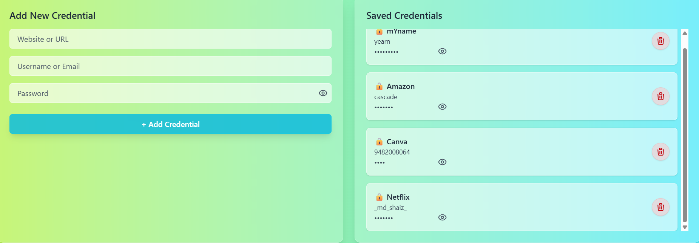

# 🔐 PassOp – A Minimal Password Manager

**PassOp** is a modern fullstack password manager focused on simplicity, security, and elegant UI. It allows users to securely store, preview, and manage credentials – all within a responsive, glassmorphic interface.

<p align="center">
  
</p>

---

##  Features

-  **Modern UI** with Tailwind CSS and glassmorphism
-  **AES-encrypted** password storage using CryptoJS
-  Toggle password visibility
-  Delete stored credentials
-  Scrollable preview of saved entries
-  Built with modular, reusable React components
-  Fast Node.js + Express backend
-  MongoDB integration with Mongoose

---

## 📁 Project Structure

```
passop/
├── client/          # React frontend
├── server/          # Node.js + Express backend
├── .gitignore
└── README.md
```

---

## 🚀 Getting Started

### Prerequisites

- Node.js (v14 or higher) + npm
- MongoDB (local installation or Atlas)

### Installation

#### 1. Clone the repository
```bash
git clone https://github.com/shaizmd/password-manager.git
cd password-manager
```

#### 2. Install dependencies

**Frontend (React):**
```bash
cd client
npm install
```

**Backend (Node.js + Express):**
```bash
cd ../server
npm install
```

### 🔐 Environment Setup

Create a `.env` file in the `server/` directory:

```env
MONGO_URI=mongodb://localhost:27017/passop
ENCRYPTION_SECRET=your_super_secret_key
```

> ⚠️ **Security Note:** Keep this secret safe. Never expose it in frontend code.

---

## 🏃‍♂️ Running the Application

### Start the Backend Server

```bash
cd server
npm start
```
Server runs on: [http://localhost:5000](http://localhost:5000)

### Start the Frontend

```bash
cd client
npm run dev
```
Frontend runs on: [http://localhost:5173](http://localhost:5173)

---

## 📸 Screenshots

### 🔐 Add Credential Form


### 📜 Saved Credential Preview


---

## 🛠️ Tech Stack

| **Frontend** | **Backend** | **Database** |
|-------------|-------------|-------------|
| React + Vite | Node.js + Express | MongoDB |
| Tailwind CSS | Mongoose ORM | |
| Axios | CryptoJS (AES) | |

---

## 🌍 Deployment Options

- **Frontend** → [Vercel](https://vercel.com/) / [Netlify](https://netlify.com/)
- **Backend** → [Render](https://render.com/) / [Railway](https://railway.app/)
- **Database** → [MongoDB Atlas](https://www.mongodb.com/cloud/atlas)

---

## 🛡️ Security Considerations

> ⚠️ **Important:** This is a learning project. For production use:

-  Never store raw passwords — use frontend encryption or zero-knowledge architecture
-  Add authentication (JWT or OAuth)
-  Enforce HTTPS on all routes
-  Consider hashing instead of reversible encryption
-  Implement rate limiting and input validation

---

## 🤝 Contributing

1. Fork the repository
2. Create a feature branch (`git checkout -b feature/amazing-feature`)
3. Commit your changes (`git commit -m 'Add some amazing feature'`)
4. Push to the branch (`git push origin feature/amazing-feature`)
5. Open a Pull Request

---

## 👨‍💻 Author

**Mohammed Shaiz**  
Crafted with 💻 and ☕ for learning and portfolio-building.

---

## 📜 License

This project is open-source and available under the [MIT License](LICENSE).


